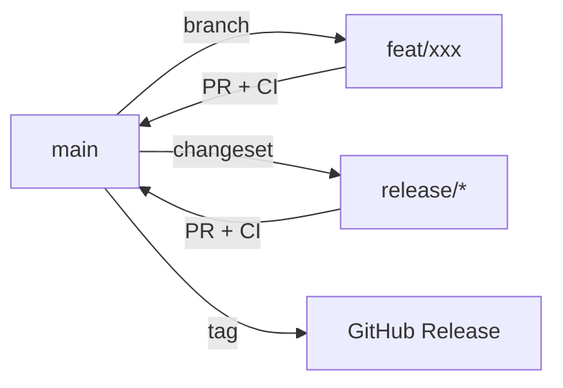

# Branching Strategy

> Source pair:
> - English: ./branching-strategy.md
> - 中文: ../zh-CN/branching-strategy.md

## Overview

Smart CI/CD uses a lightweight GitHub Flow with structured branch naming. The model is designed for a single-contributor repo with automated CI/CD.

## Branch Naming

| Pattern | Purpose | Base | Lifespan |
|---------|---------|------|----------|
| `main` | Production-ready code | — | Permanent |
| `feat/<name>` | New features | `main` | Short-lived |
| `fix/<name>` | Bug fixes | `main` | Short-lived |
| `chore/<name>` | Maintenance (deps, config, refactor) | `main` | Short-lived |
| `docs/<name>` | Documentation changes | `main` | Short-lived |
| `release/*` | Release preparation (auto-managed by changesets) | `main` | Temporary |

## Rules

### main
- Protected — every change must go through a PR (admins included)
- Requires CI checks (typecheck + test) to pass
- Direct push is forbidden — `enforce_admins` enabled
- No review required (single contributor)
- PR workflow: create PR → CI runs → merge via `gh pr merge`

### Feature / Fix / Chore / Docs
- Branch from `main`
- Must be up to date with `main` before merging
- Naming: `<type>/<kebab-case-description>` (e.g., `feat/ai-supervisor-diagnosis`, `fix/hardcoded-namespace`)
- Merge back to `main` via PR

### Release
- Managed by Changesets — created and updated automatically when `.changeset/` files are detected
- PR title: `chore: version packages`
- Merged to trigger GitHub Release

## Workflow



## CI/CD Pipeline

Every PR triggers:
1. **CI** — TypeScript typecheck + vitest unit/integration tests
2. **Docker** — Build all 10 service images (no push on PR)

Push to `main` additionally:
- Pushes Docker images to ghcr.io
- Triggers Release workflow if `.changeset/` files changed

## Single-Contributor Workflow

```bash
# 1. Branch from main
git checkout -b feat/my-feature

# 2. Code and commit
git add . && git commit -m "feat: ..."
git push -u origin feat/my-feature

# 3. Create PR (triggers CI)
gh pr create --title "feat: ..." --body ""

# 4. CI passes → merge
gh pr merge <number> --merge

# 5. Clean up local branch
git checkout main && git pull
git branch -d feat/my-feature
```

## Cleanup

- Delete local branches after they are merged
- Prune remote tracking refs periodically: `git remote prune origin`
