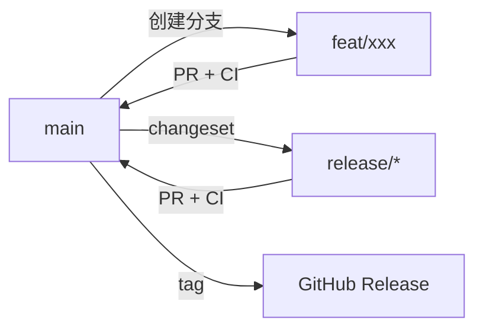

# 分支策略

> Source pair:
> - English: ../en/branching-strategy.md
> - 中文: ./branching-strategy.md

## 概述

Smart CI/CD 采用轻量级 GitHub Flow 配合结构化的分支命名规范。该模型针对单人维护的仓库设计，配合自动化 CI/CD。

## 分支命名

| 模式 | 用途 | 基线 | 生命周期 |
|------|------|------|----------|
| `main` | 生产就绪代码 | — | 永久 |
| `feat/<name>` | 新功能 | `main` | 短期 |
| `fix/<name>` | Bug 修复 | `main` | 短期 |
| `chore/<name>` | 维护（依赖、配置、重构） | `main` | 短期 |
| `docs/<name>` | 文档变更 | `main` | 短期 |
| `release/*` | 版本发布（由 changesets 自动管理） | `main` | 临时 |

## 规则

### main
- 受保护——所有变更必须通过 PR（管理员也不例外）
- CI 检查（typecheck + test）必须通过
- 禁止直接推送——`enforce_admins` 已启用
- 不需要 review（单人仓库）
- PR 流程：创建 PR → CI 运行 → `gh pr merge` 合并

### Feature / Fix / Chore / Docs
- 从 `main` 创建分支
- 合入前必须与 `main` 保持同步
- 命名规范：`<类型>/<kebab-case-描述>`（例如 `feat/ai-supervisor-diagnosis`、`fix/hardcoded-namespace`）
- 通过 PR 合并回 `main`

### Release
- 由 Changesets 管理——检测到 `.changeset/` 文件时自动创建/更新
- PR 标题：`chore: version packages`
- 合并后触发 GitHub Release

## 工作流程



## CI/CD 流水线

每个 PR 触发：
1. **CI** — TypeScript 类型检查 + vitest 单元/集成测试
2. **Docker** — 构建 10 个服务镜像（PR 不推送）

推送到 `main` 额外触发：
- 推送 Docker 镜像到 ghcr.io
- 如果 `.changeset/` 文件变更，触发 Release 工作流

## 单人工作流

```bash
# 1. 从 main 创建功能分支
git checkout -b feat/my-feature

# 2. 编码并提交
git add . && git commit -m "feat: ..."
git push -u origin feat/my-feature

# 3. 创建 PR（触发 CI）
gh pr create --title "feat: ..." --body ""

# 4. CI 通过后合并
gh pr merge <number> --merge

# 5. 清理本地分支
git checkout main && git pull
git branch -d feat/my-feature
```

## 清理

- 合并后删除本地分支
- 定期清理远程跟踪引用：`git remote prune origin`
